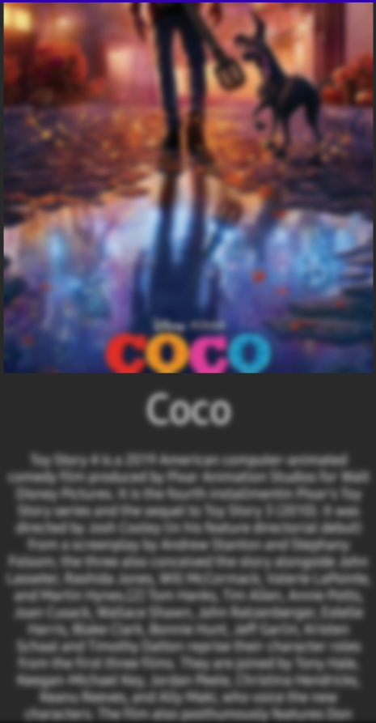

<h1 align="center">Cloudy</h1></br>

<p align="center">
  <a href="https://opensource.org/licenses/Apache-2.0"></a>
  <a href="https://android-arsenal.com/api?level=21"></a>
  <a href="https://github.com/skydoves/cloudy/actions/workflows/android.yml"></a>
  <a href="https://androidweekly.net/issues/issue-545"></a>
  <a href="https://github.com/skydoves"></a>
</p><br>

<p align="center">
☁️ Kotlin Multiplatform blur effect library for Compose, with GPU-accelerated rendering and CPU fallback for older devices.
</p><br>

> <p align="center">The `blur` modifier supports only Android 12 and higher, and `RenderScript` APIs are deprecated starting in Android 12.
> Cloudy is the backport of the blur effect for Jetpack Compose with cross-platform support.</p>

<p align="center">



</p>

## Download
[](https://search.maven.org/search?q=g:%22com.github.skydoves%22%20AND%20a:%22cloudy%22)

### Version Catalog

If you're using Version Catalog, you can configure the dependency by adding it to your `libs.versions.toml` file as follows:

```toml
[versions]
#...
cloudy = "0.2.7"

[libraries]
#...
compose-cloudy = { module = "com.github.skydoves:cloudy", version.ref = "cloudy" }
```

### Gradle
Add the dependency below to your **module**'s `build.gradle.kts` file:

```gradle
dependencies {
    implementation("com.github.skydoves:cloudy:0.2.7")
    
    // if you're using Version Catalog
    implementation(libs.compose.cloudy)
}
```

## Usage

You can implement blur effect with `Modifier.cloudy()` composable function as seen below:

```kotlin
Text(
  modifier = Modifier.cloudy(),
  text = "This text is blurred"
)
```


You can change the degree of the blur effect by changing the `radius` parameter of `Modifier.cloudy()` composable function.

```kotlin
Column(
  modifier = Modifier.cloudy(radius = 15)
) {
  Image(..)

  Text(
    modifier = Modifier
      .fillMaxWidth()
      .padding(8.dp),
    text = posterModel.name,
    fontSize = 40.sp,
    color = MaterialTheme.colors.onBackground,
    textAlign = TextAlign.Center
  )

  Text(
    modifier = Modifier
      .fillMaxWidth()
      .padding(8.dp),
    text = posterModel.description,
    color = MaterialTheme.colors.onBackground,
    textAlign = TextAlign.Center
  )
}
```

## Observing Blurring Status

You can monitor the status of the blurring effect by using the `onStateChanged` parameter, which provides `CloudyState`. This allows you to observe and respond to changes in the blurring effect's state effectively.

```kotlin
GlideImage(
  modifier = Modifier
    .size(400.dp)
    .cloudy(
      radius = 25,
      onStateChanged = { state ->
        when (state) {
          is CloudyState.Success.Applied -> {
            // GPU blur applied (iOS, Android 31+)
            // No bitmap available - blur rendered directly
          }
          is CloudyState.Success.Captured -> {
            // CPU blur completed (Android 30-)
            // Blurred bitmap available: state.bitmap
            val blurredBitmap = state.bitmap
          }
          is CloudyState.Loading -> {
            // Blur processing in progress
          }
          is CloudyState.Error -> {
            // Handle error: state.throwable
          }
          CloudyState.Nothing -> {
            // Initial state
          }
        }
      }
    ),
  ..
)
```

### CloudyState Types

| State | Description | Bitmap Available |
|-------|-------------|------------------|
| `Success.Applied` | GPU blur applied in rendering pipeline | No |
| `Success.Captured` | CPU blur completed with bitmap | Yes (`state.bitmap`) |
| `Loading` | Blur processing in progress | No |
| `Error` | Blur operation failed | No |
| `Nothing` | Initial state | No |

### Platform Support

| Platform | Implementation | Performance | State Type |
|----------|----------------|-------------|------------|
| iOS | Skia BlurEffect (Metal GPU) | GPU-accelerated | `Success.Applied` |
| Android 31+ | RenderEffect (GPU) | GPU-accelerated | `Success.Applied` |
| Android 30- | Native C++ (CPU) | NEON/SIMD optimized | `Success.Captured` |

## Maintaining Blurring Effect on Responsive Composable

The `Modifier.cloudy` captures the bitmap of the composable node under the hood.

```kotlin
LazyVerticalGrid(
  state = rememberLazyGridState(),
  columns = GridCells.Fixed(2)
) {
  itemsIndexed(key = { index, item -> item.id }, items = posters) { index, item ->
    HomePoster(poster = item)
  }
}

@Composable
private fun HomePoster(poster: Poster) {
    ConstraintLayout {
      val (image, title, content) = createRefs()
      GlideImage(
        modifier = Modifier
          .cloudy(radius = 15)
          .aspectRatio(0.8f)
          .constrainAs(image) {
            centerHorizontallyTo(parent)
            top.linkTo(parent.top)
          }
          ..
```

## Blur Effect with Network Images

You can easily implement blur effect with [Landscapist](https://github.com/skydoves/landscapist), which is a Jetpack Compose image loading library that fetches and displays network images with Glide, Coil, and Fresco. For more information, see the [Transformation](https://github.com/skydoves/landscapist#transformation) section.

## Find this repository useful? :heart:
Support it by joining __[stargazers](https://github.com/skydoves/cloudy/stargazers)__ for this repository. :star: <br>
Also, __[follow me](https://github.com/skydoves)__ on GitHub for my next creations! 🤩

# License
```xml
Designed and developed by 2022 skydoves (Jaewoong Eum)

Licensed under the Apache License, Version 2.0 (the "License");
you may not use this file except in compliance with the License.
You may obtain a copy of the License at

   http://www.apache.org/licenses/LICENSE-2.0

Unless required by applicable law or agreed to in writing, software
distributed under the License is distributed on an "AS IS" BASIS,
WITHOUT WARRANTIES OR CONDITIONS OF ANY KIND, either express or implied.
See the License for the specific language governing permissions and
limitations under the License.
```
