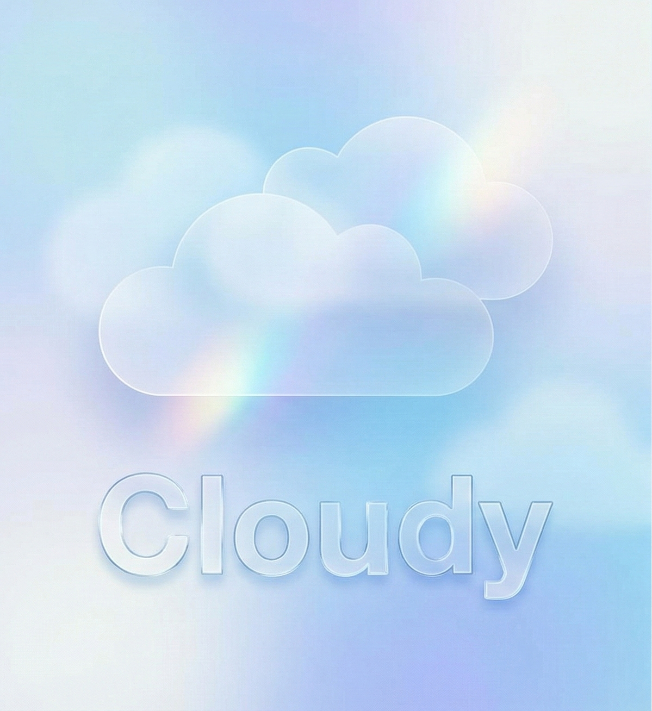
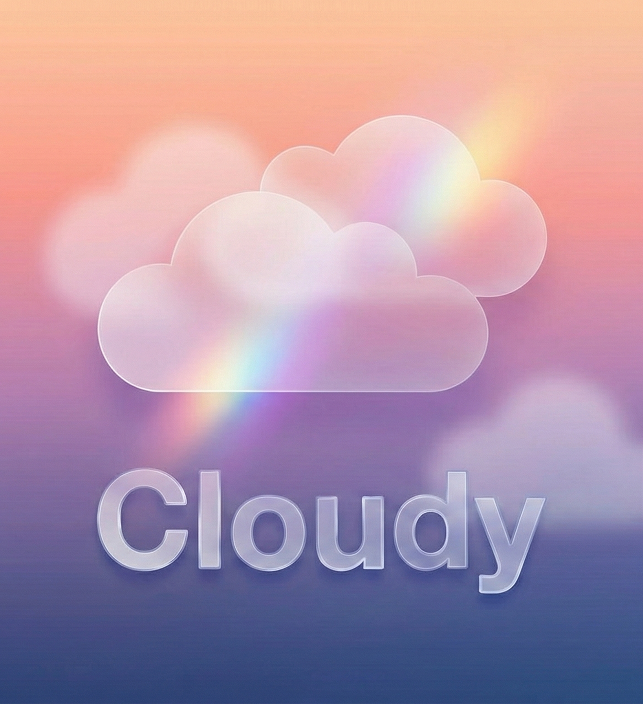
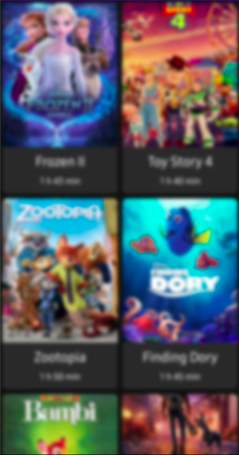
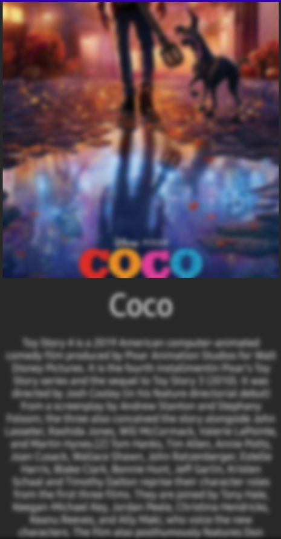
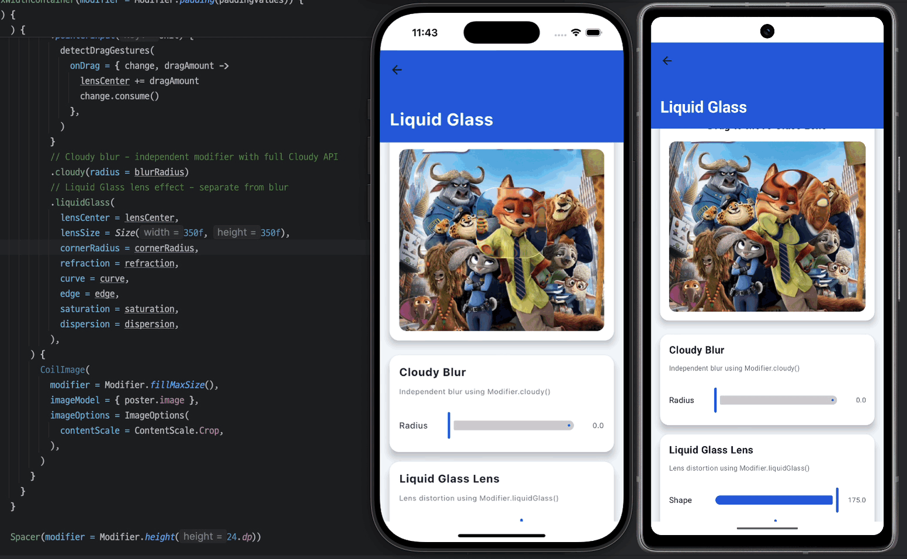

<p align="center">
  
  
</p>
<h1 align="center">Cloudy</h1></br>

<p align="center">
  <a href="https://opensource.org/licenses/Apache-2.0"></a>
  <a href="https://android-arsenal.com/api?level=23"></a>
  <a href="https://github.com/skydoves/cloudy/actions/workflows/android.yml"></a>
  <a href="https://androidweekly.net/issues/issue-545"></a>
  <a href="https://github.com/skydoves"></a>
</p><br>

<p align="center">
Kotlin Multiplatform surface effects library for Compose — blur, liquid glass, and shader-driven looks — with GPU-accelerated rendering and CPU fallback for older devices. See <a href="https://skydoves.github.io/Cloudy/">documentation</a> for more details.
</p><br>

> <p align="center">Cloudy started as a backport of the blur effect for Jetpack Compose with cross-platform support, and has grown to cover liquid glass and open shader effects as well.
> The `Modifier.cloudy(radius = …)` blur path supports only Android 12 and higher without the deprecated `RenderScript` APIs; see <a href="#platform-support-self-blur">Platform Support</a> for the CPU fallback on older devices.</p>

<p align="center">



</p>

Cloudy ships four independent effects you can mix and match on any composable — pick the ones you need:

| Effect | Modifier | What it does |
|--------|----------|---------------|
| [Self blur](#self-blur) | `Modifier.cloudy(radius = …)` | Blurs a composable's **own** content |
| [Backdrop blur](#backdrop-blur) | `Modifier.cloudy(sky = …)` | Blurs the content **behind** a composable (glassmorphism) |
| [Liquid Glass](#liquid-glass) | `Modifier.liquidGlass(…)` | A realistic glass lens with refraction and chromatic dispersion |
| [Mirage](#mirage) | `Modifier.mirage { }` | An open shader-effect plan — thin-film / specular presets, or your own |

**Table of contents**

- [Download](#download)
- **Part I — Effects**
  - [Self blur](#self-blur)
  - [Backdrop blur](#backdrop-blur)
  - [Liquid Glass](#liquid-glass)
  - [Mirage](#mirage)
- **Part II — Going further**
  - [Motion-driven light sources](#motion-driven-light-sources)
  - [Authoring your own Mirage optic](#authoring-your-own-mirage-optic)
  - [Blur effect with network images](#blur-effect-with-network-images)
- [Acknowledgements](#acknowledgements)
- [License](#license)

## Download

[](https://search.maven.org/search?q=g:%22com.github.skydoves%22%20AND%20a:%22cloudy%22)

### Version Catalog

If you're using Version Catalog, you can configure the dependency by adding it to your `libs.versions.toml` file as follows:

```toml
[versions]
#...
cloudy = "0.6.1"

[libraries]
#...
compose-cloudy = { module = "com.github.skydoves:cloudy", version.ref = "cloudy" }
```

### Gradle
Add the dependency below to your **module**'s `build.gradle.kts` file:

```gradle
dependencies {
    implementation("com.github.skydoves:cloudy:0.6.1")
    
    // if you're using Version Catalog
    implementation(libs.compose.cloudy)
}
```

For Kotlin Multiplatform, add the dependency below to your **module**'s `build.gradle.kts` file:

```gradle
sourceSets {
    commonMain.dependencies {
        implementation("com.github.skydoves:cloudy:$version")
    }
}
```

# Part I — Effects

## Self blur

Cloudy offers two blur modes: `Modifier.cloudy(radius = …)` blurs a composable's **own** content (covered here), while [Backdrop blur](#backdrop-blur) blurs the content *behind* a composable for glassmorphism surfaces.

### Basic Usage

You can implement blur effect with `Modifier.cloudy()` composable function as seen below:

```kotlin
Text(
  modifier = Modifier.cloudy(),
  text = "This text is blurred"
)
```


You can change the degree of the blur effect by changing the `radius` parameter of `Modifier.cloudy()` composable function.

```kotlin
Column(
  modifier = Modifier.cloudy(radius = 15)
) {
  Image(..)

  Text(
    modifier = Modifier
      .fillMaxWidth()
      .padding(8.dp),
    text = posterModel.name,
    fontSize = 40.sp,
    color = MaterialTheme.colors.onBackground,
    textAlign = TextAlign.Center
  )

  Text(
    modifier = Modifier
      .fillMaxWidth()
      .padding(8.dp),
    text = posterModel.description,
    color = MaterialTheme.colors.onBackground,
    textAlign = TextAlign.Center
  )
}
```

### Observing Blurring Status

You can monitor the status of the blurring effect by using the `onStateChanged` parameter, which provides `CloudyState`. This allows you to observe and respond to changes in the blurring effect's state effectively.

```kotlin
GlideImage(
  modifier = Modifier
    .size(400.dp)
    .cloudy(
      radius = 25,
      onStateChanged = { state ->
        when (state) {
          is CloudyState.Success.Applied -> {
            // GPU blur applied (iOS, Android 31+)
            // No bitmap available - blur rendered directly
          }
          is CloudyState.Success.Captured -> {
            // CPU blur completed (Android 30-)
            // Blurred bitmap available: state.bitmap
            val blurredBitmap = state.bitmap
          }
          is CloudyState.Loading -> {
            // Blur processing in progress
          }
          is CloudyState.Error -> {
            // Handle error: state.throwable
          }
          CloudyState.Nothing -> {
            // Initial state
          }
        }
      }
    ),
  ..
)
```

`CloudyState` has the following types:

| State | Description | Bitmap Available |
|-------|-------------|------------------|
| `Success.Applied` | GPU blur applied in rendering pipeline | No |
| `Success.Captured` | CPU blur completed with bitmap | Yes (`state.bitmap`) |
| `Success.Scrim` | Scrim overlay shown instead of blur (background blur on Android 30-) | No |
| `Loading` | Blur processing in progress | No |
| `Error` | Blur operation failed | No |
| `Nothing` | Initial state | No |

### Maintaining Blurring Effect on Responsive Composable

The `Modifier.cloudy` captures the bitmap of the composable node under the hood.

```kotlin
LazyVerticalGrid(
  state = rememberLazyGridState(),
  columns = GridCells.Fixed(2)
) {
  itemsIndexed(key = { index, item -> item.id }, items = posters) { index, item ->
    HomePoster(poster = item)
  }
}

@Composable
private fun HomePoster(poster: Poster) {
    ConstraintLayout {
      val (image, title, content) = createRefs()
      GlideImage(
        modifier = Modifier
          .cloudy(radius = 15)
          .aspectRatio(0.8f)
          .constrainAs(image) {
            centerHorizontallyTo(parent)
            top.linkTo(parent.top)
          }
          ..
```

### Platform Support (Self Blur)

| Platform | Implementation | Performance | State Type |
|----------|----------------|-------------|------------|
| Android 31+ | RenderEffect (GPU) | GPU-accelerated | `Success.Applied` |
| Android 30- | Native C++ (CPU) | NEON/SIMD optimized | `Success.Captured` |
| iOS | Skia BlurEffect (Metal GPU) | GPU-accelerated | `Success.Applied` |
| macOS | Skia BlurEffect (Metal GPU) | GPU-accelerated | `Success.Applied` |
| Desktop (JVM) | Skia BlurEffect (GPU) | GPU-accelerated | `Success.Applied` |
| WASM (Browser) | Skia BlurEffect (WebGL) | GPU-accelerated | `Success.Applied` |

> See [Backdrop blur](#platform-behavior-background-blur) and [Liquid Glass](#platform-support-liquid-glass) for their own platform support tables.

## Backdrop blur

Background blur — also called **backdrop blur** — blurs the content that sits *behind* a composable, producing a glassmorphism / frosted-glass surface such as a translucent app bar, bottom navigation, or card. Unlike `Modifier.cloudy(radius = …)`, which blurs a composable's **own** content, the backdrop API samples a shared snapshot of the background and renders it blurred *underneath* your overlay.

It is built from three pieces:

| API | Role |
|-----|------|
| `rememberSky()` | Creates a `Sky` — the shared state holder for the captured background. |
| `Modifier.sky(sky)` | Marks the **source** container whose content is captured for blur. |
| `Modifier.cloudy(sky = sky, …)` | The **overlay** that draws the captured background, blurred and clipped to its bounds. |

https://github.com/user-attachments/assets/c22cb656-4415-471e-a30a-521d39344447

https://github.com/user-attachments/assets/faf67c77-cb1e-4b20-994b-bb8afe340087

### Basic Usage

Put `Modifier.sky(sky)` on the background you want to blur, then overlay a composable with `Modifier.cloudy(sky = sky, …)`:

```kotlin
val sky = rememberSky()

Box(modifier = Modifier.fillMaxSize()) {
  // 1) Source — the content captured for blur
  LazyVerticalGrid(
    columns = GridCells.Fixed(2),
    modifier = Modifier.sky(sky),
  ) {
    items(posters) { poster -> GridPosterItem(poster) }
  }

  // 2) Overlay — a frosted glass app bar that blurs the grid behind it
  Box(
    modifier = Modifier
      .fillMaxWidth()
      .height(56.dp)
      .cloudy(
        sky = sky,
        radius = 20,
        tint = MaterialTheme.colorScheme.surface.copy(alpha = 0.3f),
      )
  ) {
    Text("Frosted Glass App Bar")
  }
}
```

### Clipping to a Shape

By default the blurred backdrop is clipped to a rectangle. Pass a `shape` so the blur follows rounded corners instead of leaving a hard rectangular box inside a rounded glass surface:

```kotlin
val barShape = RoundedCornerShape(36.dp)

Row(
  modifier = Modifier
    .clip(barShape)
    .cloudy(sky = sky, radius = 24, shape = barShape)
    .background(Color.White.copy(alpha = 0.15f)),
) {
  // tabs
}
```

### Progressive (Gradient) Blur

Use the `progressive` parameter to fade the blur across the surface — ideal for scroll-edge fades or vignettes:

```kotlin
// Blur is strongest at the top and fades to clear toward the bottom
Modifier.cloudy(
  sky = sky,
  radius = 25,
  progressive = CloudyProgressive.TopToBottom(),
)
```

| Mode | Effect |
|------|--------|
| `CloudyProgressive.None` | Uniform blur (default) |
| `CloudyProgressive.TopToBottom(start, end, easing)` | Blur fades from top → bottom |
| `CloudyProgressive.BottomToTop(start, end, easing)` | Blur fades from bottom → top |
| `CloudyProgressive.Edges(fadeDistance, easing)` | Blur at the edges, clear in the center (vignette) |

> Progressive blur uses an AGSL shader on Android 33+ and Skia shaders on iOS/macOS/Desktop/WASM. On Android 32 and below it falls back to uniform blur.

### Refreshing the Blur

The backdrop refreshes automatically while the background **scrolls or animates**, and parks at zero frames once it settles. When the background changes outside of a scroll/animation (for example, an image finishes loading or you swap content), call `Sky.invalidate()` to re-capture:

```kotlin
AsyncImage(
  model = imageUrl,
  modifier = Modifier.sky(sky),
  onSuccess = { sky.invalidate() },
)
```

For an animated change that lasts a known duration (e.g. a tab cross-fade), pass the duration so the blur tracks the whole transition instead of freezing once the short settle tail elapses:

```kotlin
LaunchedEffect(selectedTab) {
  sky.invalidate(durationMillis = 240) // matches the cross-fade duration
}
```

### Parameters (`Modifier.cloudy(sky = …)`)

| Parameter | Default | Description |
|-----------|---------|-------------|
| `sky` | – | The `Sky` holding the captured background (required). |
| `radius` | `20` (`CloudyDefaults.BACKGROUND_RADIUS`) | Blur radius in pixels. Must be non-negative. |
| `progressive` | `CloudyProgressive.None` | Gradient blur configuration. |
| `tint` | `Color.Transparent` | Optional color blended over the blurred backdrop. |
| `light` | `null` | Optional experimental `LiquidGlassLight`; when non-null, a moving specular highlight is drawn over the blurred backdrop. `null` leaves the blur unchanged. Requires Android API 33+ for the shader highlight (no-op below). |
| `enabled` | `true` | When `false`, the effect is disabled (renders nothing). |
| `cpuBlurEnabled` | `false` (`CloudyDefaults.CPP_BLUR_ENABLED`) | Enable CPU blur on Android 30-; otherwise a scrim is shown. |
| `shape` | `RectangleShape` | Shape the blurred backdrop is clipped to. |
| `onStateChanged` | `{}` | Callback for `CloudyState` changes. |

### Platform Behavior (Background Blur)

| Platform | API Level | Implementation | Progressive Blur |
|----------|-----------|----------------|------------------|
| Android | 33+ | AGSL RuntimeShader | Supported |
| Android | 31–32 | RenderEffect | Uniform only |
| Android | 30- | Bitmap + CPU (if `cpuBlurEnabled`) or scrim | Uniform only |
| iOS / macOS / Desktop / WASM | – | Skia BlurEffect | Supported |

> On Android 30 and below, CPU blur is disabled by default and a semi-transparent scrim (`CloudyState.Success.Scrim`) is shown instead, following a performance-first approach. Set `cpuBlurEnabled = true` to force CPU blur on those devices.

## Liquid Glass



Cloudy provides a `Modifier.liquidGlass()` that creates a realistic glass lens effect with SDF-based crisp edges, normal-based refraction, and chromatic dispersion.

**Note:** For blur effects, use `Modifier.cloudy()` separately. The two modifiers are designed to work independently, giving you full control over each effect.

### Basic Usage

```kotlin
var lensCenter by remember { mutableStateOf(Offset(100f, 100f)) }

Box(
  modifier = Modifier
    .fillMaxSize()
    .pointerInput(Unit) {
      detectDragGestures { change, _ ->
        lensCenter = change.position
      }
    }
    .cloudy(radius = 15) // Use Cloudy for blur (independent)
    .liquidGlass(lensCenter = lensCenter) // Lens distortion effect
) {
  Image(
    painter = painterResource(R.drawable.photo),
    contentDescription = null,
    modifier = Modifier.fillMaxSize()
  )
}
```

### Combining with Cloudy Blur

The `liquidGlass()` and `cloudy()` modifiers are independent and composable:

```kotlin
// Blur only
.cloudy(radius = 20)

// Lens effect only
.liquidGlass(lensCenter = lensCenter)

// Both effects combined
.cloudy(radius = 15)
.liquidGlass(lensCenter = lensCenter)
```

This separation gives you full access to Cloudy's blur API (`radius`, `onStateChanged`, `CloudyState`) while using the liquid glass lens effect.

### Customization

You can customize the liquid glass effect with various parameters:

```kotlin
.liquidGlass(
  lensCenter = lensCenter,
  lensSize = Size(350f, 350f),  // Size of the glass lens
  cornerRadius = 50f,           // Rounded corners
  refraction = 0.25f,           // Distortion amount
  curve = 0.25f,                // Lens curvature strength
  dispersion = 0.0f,            // Chromatic dispersion (RGB separation)
  saturation = 1.0f,            // Color saturation
  contrast = 1.0f,              // Light/dark contrast
  tint = Color.Transparent,     // Optional color tint
  edge = 0.2f,                  // Edge lighting width
)
```

### Parameters

| Parameter | Default | Description | Fallback (Android 32-) |
|-----------|---------|-------------|------------------------|
| `lensCenter` | - | Center position of the glass lens (required) | Yes |
| `lensSize` | 350x350 | Size of the lens in pixels | Yes |
| `cornerRadius` | 50f | Corner radius for rounded rectangle shape | Yes |
| `refraction` | 0.25f | Controls how much background distorts through lens | No (requires API 33+) |
| `curve` | 0.25f | Controls how strongly lens curves at center vs edges | No (requires API 33+) |
| `dispersion` | 0.0f | Chromatic dispersion/aberration intensity | No (requires API 33+) |
| `saturation` | 1.0f | Color saturation (1.0 = normal) | Approximation |
| `contrast` | 1.0f | Light/dark contrast (1.0 = normal) | Approximation |
| `tint` | Transparent | Optional color tint overlay | Yes |
| `edge` | 0.2f | Edge lighting width (0 = none) | Yes (as stroke) |
| `light` | Fixed | Specular light source (see [Motion-driven light sources](#motion-driven-light-sources)) | No (requires API 33+) |
| `glow` | `LiquidGlassDefaults.Glow` | Perceptual glint tuning: brightness (`intensity`) and focus (`sharpness`). Use `LiquidGlassDefaults.NoGlow` to remove the glint | No (requires API 33+) |
| `enabled` | true | Enable/disable the effect | Yes |

> **Note:** On Android 32 and below, the lens refraction effect is not available since it requires `RuntimeShader` (API 33+). The fallback draws a visible lens shape with tint, edge lighting, and color adjustments. For blur effects, use `Modifier.cloudy()` separately.

### Platform Support (Liquid Glass)

| Platform | Implementation | Features |
|----------|----------------|----------|
| Android 33+ | RuntimeShader (AGSL) | Full effect |
| Android 32- | Fallback | Tint + edge + shape (no lens refraction) |
| iOS | Skia RuntimeEffect | Full effect |
| macOS | Skia RuntimeEffect | Full effect |
| Desktop (JVM) | Skia RuntimeEffect | Full effect |
| WASM | Skia RuntimeEffect | Full effect |

> Liquid Glass also supports an optional, opt-in motion-driven light source — see [Motion-driven light sources](#motion-driven-light-sources) in Part II.

## Mirage

`Modifier.mirage { }` applies an **open shader-effect plan** to any composable: one modifier runs a plan of typed `Optic`s — either the bundled looks or optics you author yourself — against the content it wraps. It ships a family of thin-film / specular presets, and because an optic is just a kernel plus a typed uniform schema, consumers can add new effects without any library change.

Mirage is behind an experimental opt-in and is excluded from the stable ABI while its surface settles:

```kotlin
@OptIn(ExperimentalMirage::class)
@Composable
fun Poster() { /* ... */ }
```

### Basic Usage

Apply a preset by declaring a `filter` in the plan. Lens-shaped optics read a `lensCenter` (in the content's local pixels); it defaults to the content origin, so seed the pane center for a centered lens:

```kotlin
var lensCenter by remember { mutableStateOf(Offset.Zero) }

Box(
  modifier = Modifier
    .onSizeChanged { lensCenter = Offset(it.width / 2f, it.height / 2f) }
    .mirage {
      filter(MirageOptics.Specular) {
        lensCenter(lensCenter)
        lensSize(Size(520f, 520f))
        cornerRadius(120f)
      }
    },
) {
  Image(painter = painterResource(R.drawable.photo), contentDescription = null)
}
```

### Presets

The bundled optics live in `MirageOptics`:

| Preset | Kind | Look |
|--------|------|------|
| `Specular` | Composite | Lit-glass specular glint (matches the `liquidGlass` highlight) |
| `Chromatic` | Composite | Thin-film (Newton's-rings) iridescence — the default look |
| `OilSlick` | Composite | Saturated, dark-based rainbow with little wash-out |
| `SoapBubble` | Composite | Pale, pastel iridescence — few wide bands, high wash-out |
| `MetallicFoil` | Composite | Sharp metallic sheen with a Fresnel rim boost |
| `Pearl` | Composite | Soft, luminous, low-saturation lustre |
| `Foil` | Generate | Content-free overlay: glare + flowing rainbow + sparkle |
| `Duotone` | Colorize | Point-wise shadow→highlight duotone grade |

The five thin-film looks (`Chromatic` and friends) are one kernel expressed at different uniform defaults; `Specular` and the others are distinct programs.

### Clock

`Modifier.mirage(clock = …)` controls the `mirageTime` uniform that time-driven optics (e.g. `Foil`'s sparkle) read:

- `MirageClock.Auto` (default) — advances `mirageTime` from the frame loop.
- `MirageClock.Paused` — freezes it at the last value.
- `MirageClock.Fixed(seconds)` — pins it to a constant, for deterministic rendering.

### Overlays

An `overlay` composites a content-free generator on top of the filtered result under a blend mode. Ordering follows declaration, regardless of where the overlay appears in the block:

```kotlin
Modifier.mirage {
  filter(MirageOptics.OilSlick) { lensCenter(center); lensSize(size); cornerRadius(120f) }
  overlay(MirageOptics.Foil) { lensCenter(center); lensSize(size); cornerRadius(120f) }
}
```

### Platform Support (Mirage)

| Platform | Implementation | Behavior |
|----------|----------------|----------|
| Android 33+ | RuntimeShader (AGSL) | Full effect |
| Android 32- | — | Each stage is skipped; content passes through unchanged |
| iOS / macOS / Desktop (JVM) / WASM | Skia RuntimeEffect (SKSL) | Full effect |

> Want to write your own preset instead of using the bundled ones? See [Authoring your own Mirage optic](#authoring-your-own-mirage-optic) in Part II.

# Part II — Going further

The topics below extend an effect from Part I — an opt-in motion source for Liquid Glass, writing a custom Mirage optic, and using Cloudy with a network image loader. Read these once the basics above are working.

## Motion-driven light sources

*Extends: [Liquid Glass](#liquid-glass)*

By default the rim highlight uses a fixed light direction that reproduces the *direction* of the old fixed light. The specular itself is a new multi-term model (a moving focal pool, body sheen, a Blinn rim, and a back-rim, screen-blended), so the highlight looks different from pre-release versions — an intended upgrade, not a bit-for-bit match. Opt in to **gyro-driven specular** to make the highlight sweep across the glass as the device tilts (à la iOS 26 "lights move in space"):

```kotlin
@OptIn(ExperimentalLiquidGlassMotion::class)
@Composable
fun GlassCard() {
  // Hoist once and share across items in a list — one call registers one sensor.
  val light = rememberGyroLightSource(enabled = true)

  Box(
    modifier = Modifier.liquidGlass(
      lensCenter = lensCenter,
      light = light,
    ),
  ) { /* ... */ }
}
```

- **Opt-in & accessible:** the default is a fixed light *direction*; motion is opt-in. Enabling gyro only changes where the light *direction* comes from — the specular model itself is the same whether the light is fixed or motion-driven. When **Reduce Motion** is enabled (Android animator scale `0`, iOS `isReduceMotionEnabled`), the light is frozen and no sensors are registered — observed live.
- **Platform support:** Android **API 33+** (the fallback path has no shader → no-op), iOS, and any device with a motion sensor. Desktop/Web and sensorless devices keep a static light.
- **Lists:** call `rememberGyroLightSource()` **once** above the list and pass the result to each item, so a single sensor listener is shared.

> **iOS:** the consuming app's `Info.plist` **must** declare `NSMotionUsageDescription`, or recent iOS terminates the app on the first device-motion read. iOS v1 uses a portrait-oriented projection; landscape is not yet remapped.

### Transform-driven light (no sensor)

`rememberTransformLightSource` is the sibling of `rememberGyroLightSource`. Instead of the device gyro, it drives the highlight from a composable's **own** `rotationX` / `rotationY` — the same values you apply through `Modifier.graphicsLayer`. It needs no sensor, no platform code, and works on every target including Desktop and Web:

```kotlin
@OptIn(ExperimentalLiquidGlassMotion::class)
@Composable
fun TiltCard() {
  var rx by remember { mutableFloatStateOf(0f) }
  var ry by remember { mutableFloatStateOf(0f) }
  val light = rememberTransformLightSource(rotationX = { rx }, rotationY = { ry })

  Box(
    modifier = Modifier
      .graphicsLayer { rotationX = rx; rotationY = ry; cameraDistance = 12f * density }
      .liquidGlass(lensCenter = lensCenter, light = light),
  ) { /* ... */ }
}
```

The rotations are read as lambdas (deferred reads) so per-frame updates invalidate the draw without recomposing the modifier, matching the gyro source's behavior.

### Glint tuning

The `glow` parameter tunes the specular glint with two perceptual knobs: `intensity` (brightness) and `sharpness` (focus). Build one with the `LiquidGlassGlow(intensity = …, sharpness = …)` factory, or use `LiquidGlassDefaults.NoGlow` to switch the glint off. The full set of shader tunables — `glowRimMix` and `glowWidthPx`, alongside `glowIntensity` / `glowSharpness` — lives on the experimental `Modifier.liquidGlassTuned` overload, intended for live experimentation rather than the committed API surface.

## Authoring your own Mirage optic

*Extends: [Mirage](#mirage)*

An optic is a kernel plus a `MirageParams` subclass whose property names are the shader uniform identifiers. A `composite` optic authors a full `half4 main(float2 xy)` and samples the content through the compiler-provided `content` shader:

```kotlin
class VignetteParams : MirageParams() {
  val strength by uniform(0.6f)
}

val Vignette = Optic.composite(
  name = "vignette",
  paramsFactory = ::VignetteParams,
  agsl = VIGNETTE_SRC,
  sksl = VIGNETTE_SRC, // AGSL and SKSL are the same text here
)

private const val VIGNETTE_SRC = """
half4 main(float2 xy) {
    half4 src = content.eval(xy);
    float2 uv = xy / mirageResolution;          // standard uniform, auto-declared when referenced
    float d = distance(uv, float2(0.5));
    float v = 1.0 - strength * smoothstep(0.3, 0.75, d);
    return half4(src.rgb * half(v), src.a);
}
"""
```

Apply it exactly like a preset: `Modifier.mirage { filter(Vignette) { strength(0.8f) } }`.

The other factories are `Optic.colorize` (a point-wise `half4 kernel(float2 p, half4 src)` that never reaches `content` directly), `Optic.generate` (a content-free overlay), and `Optic.raw` (an escape hatch that emits your source verbatim). The compiler declares the standard uniforms (`mirageResolution` / `mirageTime` / `mirageDensity`) only when the kernel references them, and rejects kernels that use derivative builtins, preprocessor directives, or the raw fragment-coord builtin (none of which compile as a runtime shader).

## Blur effect with network images

*Extends: [Self blur](#self-blur)*

You can easily implement blur effect with [Landscapist](https://github.com/skydoves/landscapist), which is a Jetpack Compose image loading library that fetches and displays network images with Glide, Coil, and Fresco. For more information, see the [Transformation](https://github.com/skydoves/landscapist#transformation) section.

---

## Find this repository useful? :heart:
Support it by joining __[stargazers](https://github.com/skydoves/cloudy/stargazers)__ for this repository. :star: <br>
Also, __[follow me](https://github.com/skydoves)__ on GitHub for my next creations! 🤩

## Acknowledgements

The liquid glass shader implementation was inspired by [FletchMcKee/liquid](https://github.com/FletchMcKee/liquid).

## License
```xml
Designed and developed by 2022 skydoves (Jaewoong Eum)

Licensed under the Apache License, Version 2.0 (the "License");
you may not use this file except in compliance with the License.
You may obtain a copy of the License at

   http://www.apache.org/licenses/LICENSE-2.0

Unless required by applicable law or agreed to in writing, software
distributed under the License is distributed on an "AS IS" BASIS,
WITHOUT WARRANTIES OR CONDITIONS OF ANY KIND, either express or implied.
See the License for the specific language governing permissions and
limitations under the License.
```
